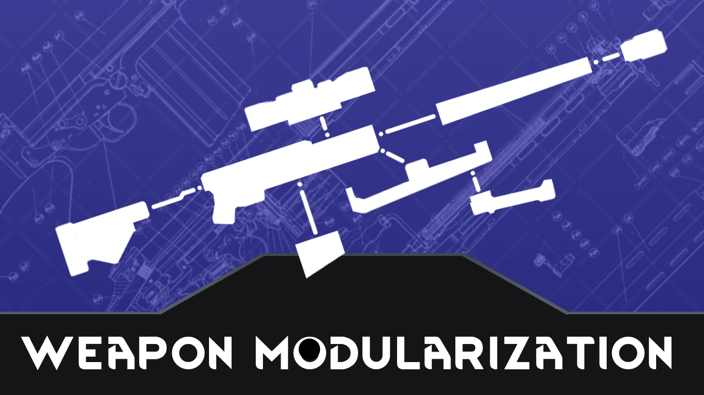

# RW - Weapon Modularization
**A mod for the game Rimworld, base by RW_NodeTree.**

**Allow to make the weapon consist by multi part**

---
## Base Usage

This mod allow create weapon with traditional method and modify with `Machining table` or other `Modify Port` set in the mod. And also, some port probably will not allow to modify some weapon, that depand with moder set.

To modify weapon, select a colonist first, then right click `Modify Port` select `Start Modify Weapon`.

## For Modder
> - [Create Attachment](Create_Attachment.md)
> - [Create Attachment Or Weapon With Attachments](Create_Attachment_Or_Weapon_With_Attachments.md)
> - [Create Sub Weapon](Create_Sub_Weapon.md)

